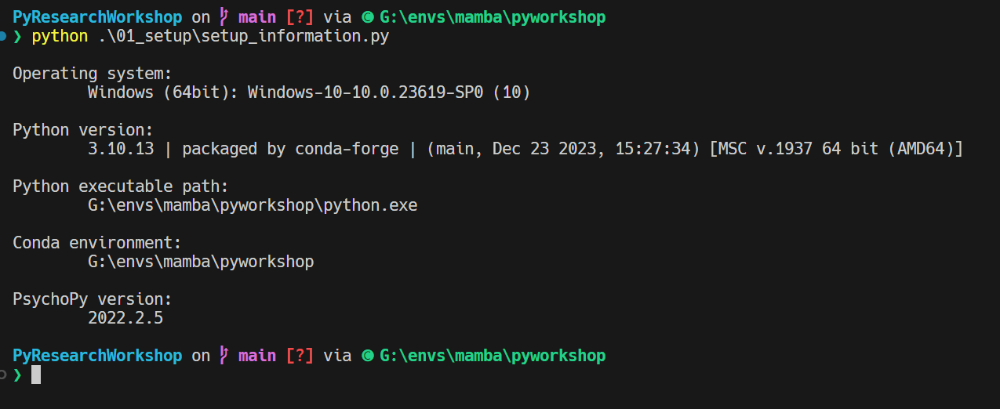

# Setup

## Table of Contents

- [Setup](#setup)
  - [Table of Contents](#table-of-contents)
  - [Preparation](#preparation)
  - [Cloning the repository](#cloning-the-repository)
  - [Opening the repository in VScode](#opening-the-repository-in-vscode)
  - [Installing the VScode Python extension](#installing-the-vscode-python-extension)
  - [Setting up the Python environment in VScode](#setting-up-the-python-environment-in-vscode)
  - [Done!](#done)

## Preparation

If you've successfully followed the instructions in the main [README.md](../README.md) file, you are ready to complete the following steps.

## Cloning the repository

* Open a terminal (the same way you did to set up the environment)
* Navigate to a folder where you want to store the workshop files
  * You can use the command `cd` to **change directory**, e.g. `cd Documents` will change to the Documents folder. You can use `cd ..` to go up a folder, e.g. if you are in `Documents` and you run `cd ..` you will be in the folder that contains `Documents`
  * You can also create a new folder for code / projects if you don't have one using the `mkdir` command, e.g. `mkdir projects` will create a new folder called `projects` within the current folder. If you do this, don't forget to `cd` into the new folder
  * You can always find the current folder you are in by running the command `pwd` (**print working directory**)
* Once you are in the folder you want to store the workshop files, run the command `git clone https://github.com/zeyus/PyResearchWorkshop.git` and press enter. This will create a folder called `PyResearchWorkshop` and download all the files from this repository into it.

## Opening the repository in VScode

* Open VScode
* Click on `File` > `Open Folder...` and navigate to the folder where you cloned the repository
* Click on the `PyResearchWorkshop` folder and click `Open`
* You should see the folder structure on the left side of the VScode window, and the files in the `PyResearchWorkshop` folder on the right side of the VScode window

## Installing the VScode Python extension

* Click on the `Extensions` icon on the left side of the VScode window (it looks like a square with four squares inside it)
* Search for `Python` and click on the `Python` extension by Microsoft, alternatively you can click [here](https://marketplace.visualstudio.com/items?itemName=ms-python.python) to go directly to the extension page
* Click on the `Install` button
* Once the extension is installed, click on the `Reload` button

## Setting up the Python environment in VScode

We want to make sure that VSCode and Python will use the environment we set up earlier. To do this, we need to tell VSCode where the environment is located.

* Open the command palette by pressing `Ctrl + Shift + P` (Windows) or `Cmd + Shift + P` (Mac)
* Type `Python: Select Interpreter` and press enter or click on it (you don't need to type the whole thing, it should show up in the list as you type)
* You should see a list of Python interpreters, one of them should be called `Python 3.10.13 ('pyworkshop': conda)` (or similar)
* Click on the `Python 3.10.13 ('pyworkshop': conda)` interpreter

Now, in order to test everything we've done, in this folder, there is a file called `setup_information.py`. We can run this file to check that everything is working.

There are many ways to run a script from within VSCode, but for now let's use the built-in terminal.

* Click on the `Terminal` menu at the top of the VSCode window
* Click on `New Terminal`
* You should see a new terminal window open at the bottom of the VSCode window
* (*Optional, in case you don't see `(pyworkshop)`*) In the terminal window, type `mamba activate pyworkshop` and press enter
* Now type `python setup_information.py` and press enter
* You should see some information about your Python environment printed in the terminal window, it should look like this:

## Upgrading PsychoPy

For some reason, the version of PsychoPy that is installed by default is not the latest version. We can upgrade it to the latest version by running the following command in the terminal:

* `pip install psychopy --upgrade`

## Done!

You're all set up and ready to go!
