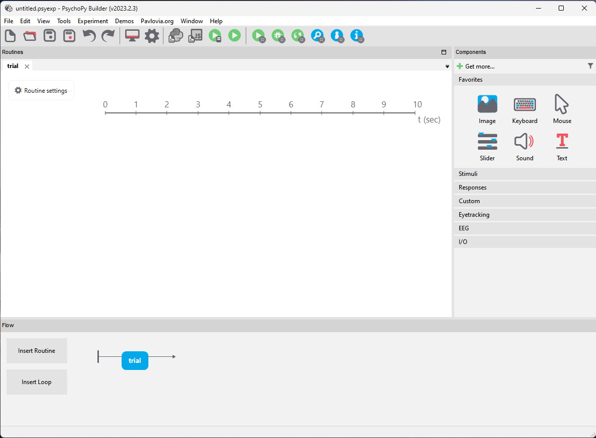
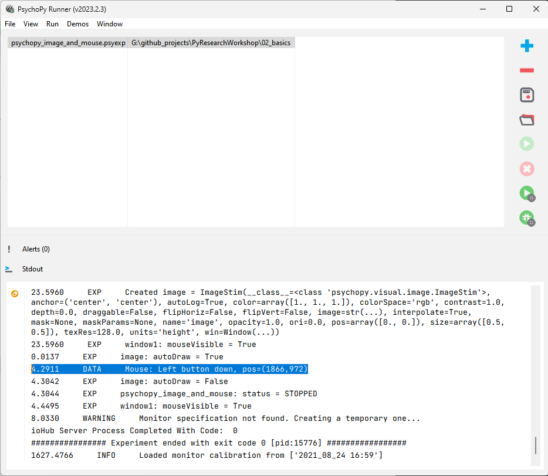

# Basics

This section will cover a few simple Python concepts, and then we will set up a basic experiment in PsychoPy using python.

## Core Python Concepts

Note: This is not a comprehensive introduction to Python, it is just a quick overview of some of the concepts we will use in the workshop.

Open up the file [`02_basics/01_python.py`](./01_python.py) in VSCode and follow along with the comments in the file.

## PsychoPy GUI

Alright, first let's go very briefly over some of the features of PsychoPy that you can use via the GUI (Graphical User Interface). If you like the idea of using the graphical interface you can read more in the [PsychoPy Builder Documentation](https://psychopy.org/builder/index.html).

Open up PsychoPy, we can use our terminal in VSCode to open it by typing `psychopy` and pressing enter. *Note: remember to make sure you have the `pyworkshop` environment activated, you can do this by typing `conda activate pyworkshop` in the terminal and pressing enter, you should see `(pyworkshop)` at the start of the line*

You should see a window like this:

This is the PsychoPy Builder window, it is where you can create experiments using a graphical interface. You can click on components on the right side of the window to create your experiment. As you can see, some of the concepts such as "loops" that we covered in the previous section are also relevant here.

You may be able to get quite a long way using just the builder interface, but there are some things that are easier to do using code. For example, if you want to create a list of stimuli that you want to present, it is easier to do this using code than to manually create a component for each stimulus.
You can also use code in the builder interface to do things like randomise the order of stimuli, or to create a counterbalance for the order of stimuli, but as this requires some programming knowledge anyway, it is often easier to just write the whole thing in code.

Just for fun, let's create a simple experiment using the builder interface.

We can add an image and a mouse component. The image component will display an image on the screen, and the mouse component will record mouse clicks and move on to the next trial (or end) when the mouse is clicked.

* For the image, we can use the image `02_basics/res/party-stuff.png`, make sure you give it a "name". Set the duration to "condition" and set it to False. This means that the image will be displayed until the mouse is clicked.

* For the mouse component we can set the `End Routine on press` field to `any click` as well as the name of your image component under "clickable stimuli". Set the duration to "condition" and set it to False. This means that the mouse will wait for a click before moving on to the next trial.

Now we can save the experiment (call it whatever you like), and run it with the green "play" icon at the top of the window. You should see the image displayed, and when you click the mouse, the experiment will end. *Note: it might take a while to load the first time you run it, this is normal*

If it worked successfully, you should see, after clicking, some output in the "PsychoPy Runner" window that looks like this:

Note that we have successfully gathered some data, including the time of the mouse click, and the location of the click. By default, these will be stored in files under the `data` folder in the same folder as your experiment file. Feel free to take a look.

## PsychoPy Code