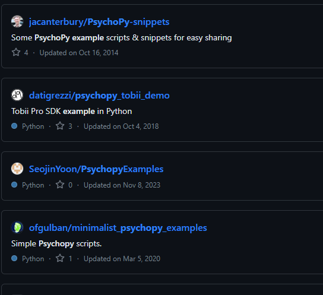

# Resources for Conducting Research with PsychoPy

## Table of Contents

- [Resources for Conducting Research with PsychoPy](#resources-for-conducting-research-with-psychopy)
  - [Table of Contents](#table-of-contents)
  - [Introduction](#introduction)
  - [General Programming / Python](#general-programming--python)
  - [PsychoPy](#psychopy)

## General Programming / Python

* [Python Documentation](hhttps://docs.python.org/3/index.html)
  * The official Python documentation, lots of useful information and links to resources, including beginner's guides
* [Automate the Boring Stuff with Python](https://automatetheboringstuff.com/)
  * Available for free online, a great introduction to Python and programming in general
* [Python for Everybody](https://www.py4e.com/)
  * Available for free online, a more structured course-like introduction to Python
* [Python Data Science Handbook](https://jakevdp.github.io/PythonDataScienceHandbook/)
  * Free handbook for using Python for data science, data analysis and plotting

If you need some help with how to tackle a specific problem, experiment, etc, you can try searching for it on [Stack Overflow](https://stackoverflow.com/), it's a great resource for finding answers to questions that have already been asked by others. Don't be afraid to ask questions yourself, but make sure you read the [How to Ask](https://stackoverflow.com/help/how-to-ask) page first.

## PsychoPy

* [PsychoPy Documentation](https://psychopy.org/documentation.html)
  * The official PsychoPy website, lots of useful information and links to resources
* [PsychoPy YouTube Channel](https://www.youtube.com/@PsychoPy_official/videos)
  * The official PsychoPy YouTube channel, includes tutorials for doing various things in psychopy
* [PsychoPy Discourse](https://discourse.psychopy.org/)
  * The official PsychoPy forum, you can ask questions here and search for answers to questions others have asked

Also take a look at [GitHub](https://github.com/) for other people's code, you can search for things like ["psychopy"]((https://github.com/search?q=psychopy&type=repositories)) and see what comes up. You can also search for ["psychopy tutorial"](https://github.com/search?q=psychopy%20tutorial&type=repositories) or ["psychopy example"](https://github.com/search?q=psychopy+example&type=repositories) to find code that people have shared.

